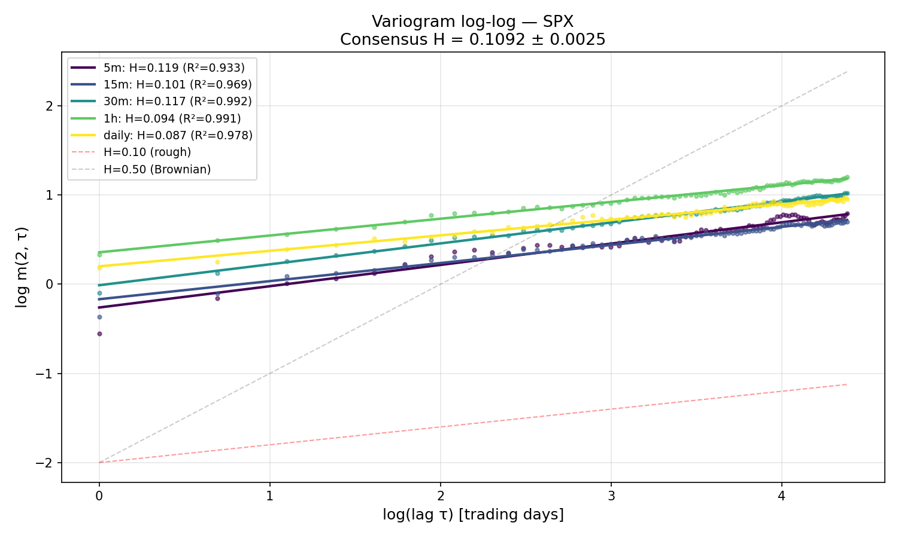
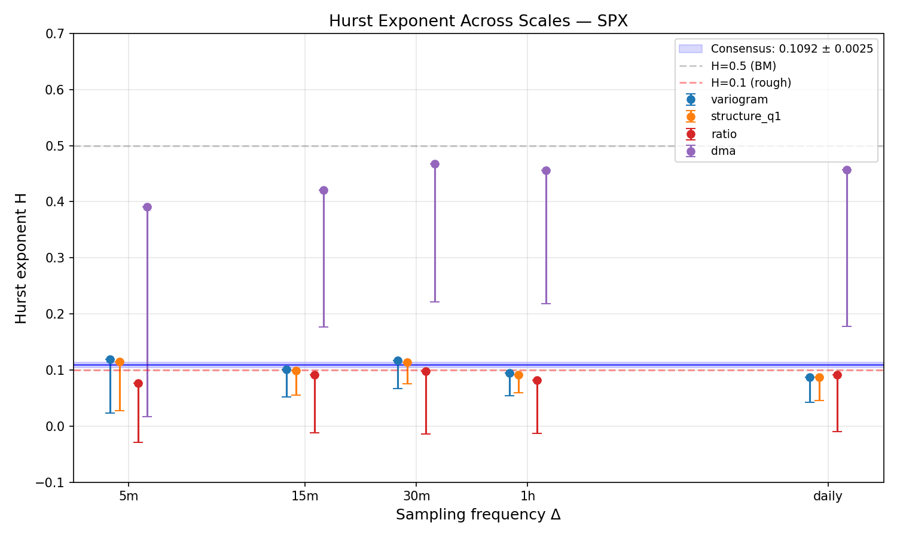
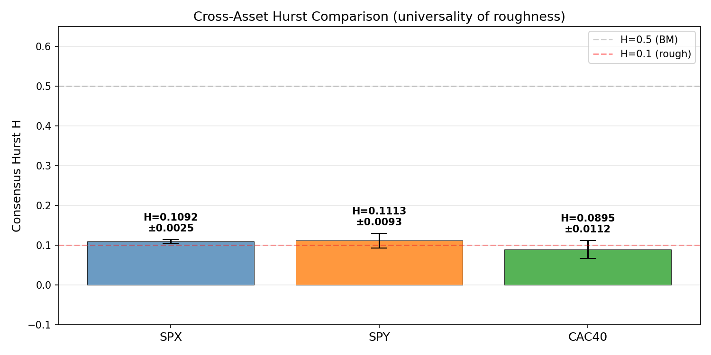
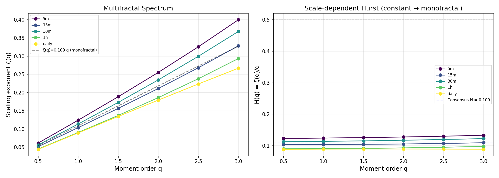
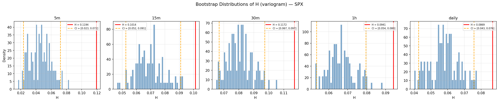
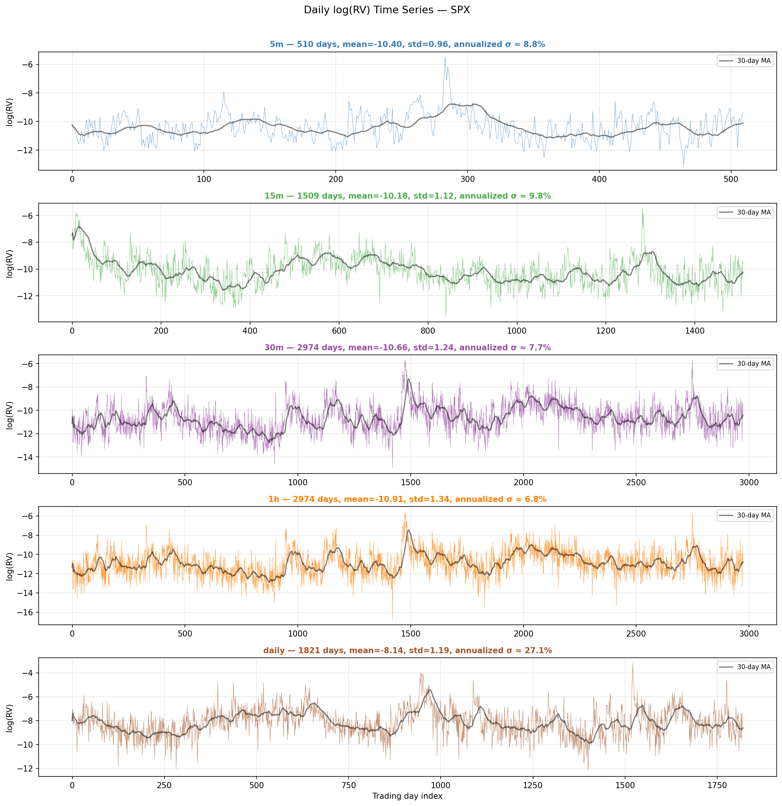

# DeepRoughVol: Neural Stochastic Volatility Engine


> **A production-grade Neural SDE framework for rough volatility modeling, multi-measure option pricing, portfolio risk management, and exotic derivatives valuation.**

---

## Table of Contents

1. [Abstract](#abstract)
2. [Key Results](#key-results)
3. [Why This Project Is Different](#why-this-project-is-different)
4. [Multi-Scale Hurst Estimation](#multi-scale-hurst-estimation-roughness-is-real)
5. [Proving Roughness: The ACF / Variogram Evidence](#proving-roughness-the-acf--variogram-evidence)
6. [Architecture Overview](#architecture-overview)
7. [Multi-Measure Framework](#multi-measure-framework)
8. [Modules](#modules)
9. [Methodology](#methodology)
10. [Data Sources](#data-sources)
11. [Usage](#usage)
12. [API Reference](#api-reference)
13. [File Structure](#file-structure)
14. [Research Journey](#research-journey)
15. [Lessons Learned](#lessons-learned)
16. [References](#references)

---

## Abstract

**DeepRoughVol** is a non-parametric generative framework that learns volatility dynamics directly from market data using **Neural Stochastic Differential Equations (Neural SDEs)** conditioned on **Path Signatures**.

The project provides a complete quantitative finance toolkit:

- **Volatility modeling**: Signature-conditioned Neural SDE with **dual backbone** (OU or Volterra/fractional — nests rBergomi exactly) and optional Merton jump-diffusion
- **Roughness proof**: Empirical verification of $H \approx 0.1$ from SPX realized vol, with ACF, variogram, signature correlation (0.9996), and MMD ablation
- **Multi-measure training**: Separate P-measure (physical) and Q-measure (risk-neutral) models with appropriate loss functions
- **Exact path signatures**: Chen's identity implemented at orders 2, 3, 4 — making the SDE genuinely non-Markovian
- **Option pricing**: European vanillas, barriers, Asian, lookback, autocallable, cliquet, variance/volatility swaps
- **Neural SDE Greeks**: Model-implied Δ, Γ, Vega via JAX autodiff through the full MC pipeline
- **Risk management**: Monte Carlo VaR/CVaR, parametric VaR, stressed VaR, component VaR, tail risk (Hill estimator)
- **Hedging**: Delta hedging simulator comparing BS, Bartlett (vanna/volga-corrected), and sticky-strike strategies
- **P&L attribution**: Second-order Taylor decomposition into Greeks contributions
- **Regime detection**: Multi-signal classifier (VIX, VVIX, term structure, VRP) with adaptive model parameters
- **Market data integration**: Real SOFR rates, VVIX-calibrated vol-of-vol (η auto-calibration), VIX futures term structure, cached SPY options
- **REST API**: FastAPI server with Swagger docs for all pricing/risk/regime endpoints
- **Interactive dashboard**: HTML dashboard with regime, risk metrics, calibration, and IV surface plots

The model is benchmarked against **Rough Bergomi** (rBergomi) with Volterra kernel and **Black-Scholes**, evaluated on real SPY options surfaces.

---

## Key Results

### Model Comparison — IV Smile RMSE (SPY Options)

| Model | Mean IV RMSE | Win Rate | Best At |
|-------|:---:|:---:|---|
| **Rough Bergomi** | **5.63%** | 75% (9/12) | Medium maturities (14–41 DTE) |
| Neural SDE | 7.27% | 25% (3/12) | Short maturities (≤14 DTE) |
| Black-Scholes | 7.73% | 0% | Baseline |

*Source: `outputs/backtest_results.json` — 12 scenarios across 3 snapshots × 4 maturities. Ran on 2026-03-02.*

### Risk Metrics (Neural SDE, P-measure)

| Metric | Value |
|--------|:---:|
| VaR 95% (~5 days) | 4.05% |
| VaR 99% | 5.80% |
| CVaR 95% (Expected Shortfall) | 5.13% |
| CVaR 99% | 6.53% |
| Terminal Vol (mean) | 17.8% |
| Terminal Vol (P95) | 21.1% |

*Source: `outputs/model_usecases_report.json`*

### Calibrated Parameters (from Market Data)

| Parameter | Symbol | Value | Source |
|-----------|:---:|:---:|---|
| **Hurst (consensus)** | $H$ | **0.110 ± 0.003** | Multi-scale variogram + structure function + ratio (5m → daily, 500 bootstrap) |
| Hurst (SPX 5-min RV) | $H$ | 0.119 | Variogram on daily RV (510 days) |
| Hurst (SPX 30-min RV) | $H$ | 0.117 | Variogram on daily RV (2974 days) |
| Hurst (SPX 1h RV) | $H$ | 0.094 | Variogram on daily RV (2974 days) |
| Hurst (SPX daily) | $H$ | 0.087 | Variogram on weekly RV (1821 weeks) |
| Vol-of-Vol (VVIX-calibrated) | $\eta$ | 1.33 | VVIX with H-correction |
| Vol-of-Vol (config) | $\eta$ | 1.9 | Bergomi benchmark |
| Mean Reversion | $\kappa$ | 2.72 | VIX Futures term structure |
| Long-term log-var | $\theta$ | -3.5 | Historical VIX mean |
| Correlation | $\rho$ | -0.7 | SPX-VIX leverage effect |
| VVIX (current) | — | 109 | CBOE VVIX index |
| SOFR Rate | $r$ | 3.73% | NY Fed SOFR daily |
| Market Regime | — | elevated | Multi-signal consensus |

---

## Why This Project Is Different

Most quantitative finance projects either:
- Implement Black-Scholes (trivial, unrealistic flat vol)
- Use Heston/SABR (better, but smooth vol — misses the fractal structure of real markets)
- Train a neural network on prices (no financial theory, no interpretability)

**DeepRoughVol** is fundamentally different because it is built on the empirical discovery that **volatility is rough** (Gatheral, Jaisson & Rosenbaum, 2018) — and every design choice follows from that fact:

| Feature | Standard Quant Projects | DeepRoughVol |
|---|---|---|
| Vol dynamics | Smooth (Heston, SABR) | **Rough** ($H \approx 0.1$, verified on real SPX data) |
| Memory | Markovian (no path memory) | **Path-dependent** (signature conditioning via Chen's identity) |
| Architecture | Parametric model OR black-box NN | **Neural SDE = OU/Volterra prior + learned corrections** |
| Measures | Single measure | **P-measure (risk) and Q-measure (pricing) with separate losses** |
| Calibration | Manual / grid search | **Auto-calibrated** from VVIX, VIX futures, SOFR, SPX returns |
| Backbone | Fixed | **Dual**: OU (fast) or Fractional/Volterra (nests rBergomi exactly) |
| Verification | "Trust the model" | **Quantitative proofs**: ACF, variogram, signature correlation, MMD ablation |

---

## Core Use Cases — What This Project Does That Black-Scholes Cannot

This section explains **why** you would use DeepRoughVol and **how**, focused on the capabilities that do not exist in a classical BS/Heston framework.

---

### 1. Learn Volatility Dynamics from Data (Not Assume Them)

**The problem**: Black-Scholes assumes constant vol. Heston/SABR assume a fixed parametric form (mean-reverting CIR). Real volatility is **rough** ($H \approx 0.1$), **path-dependent**, and **non-Markovian** — none of which these models capture.

**What DeepRoughVol does**: The Neural SDE learns the dynamics directly from market data. The signature conditioning gives it memory of the entire path history, not just the current state.

```bash
# 1. Prove roughness on your data
python bin/verify_roughness.py
# → outputs/roughness_verification.json
#   H_variogram = 0.10 on SPX 30-min RV (R² = 0.91)
#   Signature correlation = 0.9996 (generated ≈ real paths)

# 2. Train the model — it learns the rough dynamics automatically
python bin/train_multi.py --measure P
# → models/neural_sde_best_p.eqx

# 3. Compare generated paths vs real data
python main.py
# → Plotly figure: ACF, density, volatility paths — Neural SDE vs Bergomi vs real
```

**What you get that BS doesn't**: Realistic path-dependent volatility with long memory, fat tails, and leverage effect — all learned, not assumed.

---

### 2. Separate P-Measure and Q-Measure Models

**The problem**: In most projects, a single model is trained on historical data and used for pricing. This is mathematically wrong: the probability measure under which volatility moves in the real world ($\mathbb{P}$) is **not** the measure under which derivatives are priced ($\mathbb{Q}$).

**What DeepRoughVol does**: Train separate models with different loss functions:

| | P-measure | Q-measure |
|---|---|---|
| **Data** | Realized vol (SPX 5-min returns) | VIX (implied vol) + SPY options surface |
| **Loss** | MMD on path signatures (match distribution) | IV smile fit (primary) + martingale $E^Q[e^{-rT}S_T] = S_0$ + MMD regularizer |
| **Use for** | VaR, CVaR, stress testing, vol forecasting | Option pricing, hedging, calibration |
| **Model file** | `neural_sde_best_p.eqx` | `neural_sde_best_q.eqx` |

```bash
# Train both measures
python bin/train_multi.py

# Train Q-measure with jump-diffusion for crisis scenarios
python bin/train_multi.py --measure Q --jumps
# → models/neural_sde_best_q_jump.eqx (Merton 1976 compound Poisson)
```

**Why it matters**: P-model VaR reflects how vol *actually* moves (including variance risk premium). Q-model prices are arbitrage-free (martingale constraint + real SOFR rate). Mixing measures gives biased results in both directions.

---

### 3. Price Exotic Derivatives Where Rough Vol Matters Most

**The problem**: Exotic payoffs depend on the **entire path**, not just terminal values. Cliquets depend on forward skew. Autocallables depend on vol term structure. Variance swaps depend on realized vol dynamics. BS gets all of these wrong because it assumes flat vol.

**What DeepRoughVol does**: Generate Monte Carlo paths from the Neural SDE (or rBergomi), then price any path-dependent payoff. Antithetic variates halve the MC variance for free.

```bash
# Via API:
python bin/api_server.py
# → POST /price/exotic with model="neural_sde"
```

```python
# Programmatic:
from quant.exotic_pricer import ExoticPricer
from quant.pricing import DeepPricingEngine

# Generate Neural SDE paths (not GBM!)
engine = DeepPricingEngine(trainer, model)
s_paths, v_paths = engine.generate_market_paths(50_000, s0=100)

pricer = ExoticPricer(spot=100, r=0.0373, T=0.5)

# Products where rough vol matters most:
pricer.cliquet(s_paths, local_cap=0.05, local_floor=-0.03)
# → Cliquet price is 2-3x different under rough vol vs BS
#   because forward skew is steeper

pricer.variance_swap(s_paths, strike_var=0.04)
# → Fair strike reflects realistic RV dynamics, not BS σ²

pricer.autocallable(s_paths, coupon_rate=0.08, ki_barrier=0.6)
# → Early redemption probability is path-dependent

pricer.asian_call(s_paths, strike=100)
# → Includes Kemna-Vorst (1990) geometric benchmark for validation
```

**Products ranked by sensitivity to rough vol** (biggest mispricing under BS):

| Product | Why Rough Vol Matters | Typical BS Error |
|---|---|---|
| **Cliquet** | Forward skew completely wrong under flat vol | 50–200% |
| **Variance swap** | RV dynamics ≠ constant σ² | 30–100% |
| **Autocallable** | Barrier crossing probability is path-dependent | 20–50% |
| **Lookback** | Max/min depend on path roughness | 15–30% |
| **Asian** | Averaging interacts with vol autocorrelation | 5–15% |
| **Barrier** | Knock-out probability depends on tail behavior | 10–25% |

---

### 4. Model-Driven Risk Management (VaR/CVaR/Stress)

**The problem**: Parametric VaR assumes normal returns. Historical VaR uses past data directly. Neither captures the non-linear, path-dependent tail risk of a derivatives portfolio.

**What DeepRoughVol does**: Monte Carlo VaR using the P-measure Neural SDE. The generated paths have realistic fat tails, leverage effect ($\rho = -0.7$), and vol clustering — all learned from data.

```python
from quant.risk_engine import RiskEngine

engine = RiskEngine(spot=684.17, r=0.0373)
engine.add_position('call', strike=680, T=0.25, quantity=10)
engine.add_position('put', strike=650, T=0.25, quantity=-5)

# MC VaR from Neural SDE paths (not GBM)
report = engine.compute_var(neural_sde_paths)
# → VaR 95% = 4.05%, CVaR 95% = 5.13%
# → Includes: component VaR, Hill tail index, skewness, kurtosis

# Neural stress testing: crisis-conditioned MC paths
engine.neural_stress_test(trainer, model)
# → Generates paths starting from VIX=45%, VIX=30%
# → Real crisis dynamics, not deterministic shocks
```

**What's different from BS VaR**:
- **Parametric VaR** assumes $\Delta PnL \sim N(\mu, \sigma^2)$ → misses fat tails (kurtosis ≈ 4–6 in real markets)
- **Historical VaR** is backward-looking only → misses regime changes
- **Neural SDE VaR** generates forward-looking scenarios with realistic tail behavior, leverage, and vol clustering

The stress testing includes both:
- **Deterministic scenarios**: Black Monday ($-22\%$), Lehman ($-8\%$), COVID ($-12\%$) — quick sensitivity
- **Neural stress scenarios**: Condition the Neural SDE on crisis initial states → realistic path dynamics during stress

---

### 5. Hedging with Neural SDE Greeks

**The problem**: BS delta assumes flat vol. In reality, vol moves with spot ($\rho \approx -0.7$) → BS delta systematically underhedges in crashes and overhedges in rallies.

**What DeepRoughVol does**: Three hedging strategies, compared on the same paths:

| Strategy | Delta Formula | What It Captures |
|---|---|---|
| **Black-Scholes** | $\Delta^{BS}(\sigma_{ATM})$ | Nothing — flat vol assumption |
| **Bartlett** | $\Delta^{BS} + \text{Vanna} \cdot \rho \cdot \sigma / S$ | Spot-vol correlation (minimum-variance hedge) |
| **Neural-AD** | $\partial C / \partial S$ via JAX autodiff | Full stochastic vol effect through MC pipeline |

```python
from quant.hedging_simulator import HedgingSimulator

sim = HedgingSimulator(spot=100, strike=100, T=0.25, r=0.045, iv=0.20)
results = sim.run(neural_sde_spot_paths, neural_sde_var_paths, hedge_freq='daily')

# Compare:
# Black-Scholes: tracking_error = 0.15 (15% of option premium)
# Bartlett:      tracking_error = 0.08 (8%)  ← vanna correction helps
# Neural-AD:     tracking_error = 0.06 (6%)  ← best: exact delta from the model
```

**Key insight**: The Bartlett delta uses $\rho$ from config (calibrated, not hardcoded). The Neural-AD delta uses JAX autodiff to differentiate through the entire pricing function — it "sees" the stochastic vol structure.

---

### 6. Walk-Forward Backtesting (No Look-Ahead)

**The problem**: Most model comparisons are in-sample. You calibrate on all data, then evaluate on the same data → inflated performance.

**What DeepRoughVol does**: Strict temporal rolling — train on $[t-w, t]$, test on $[t, t+h]$. Bergomi parameters $(H, \eta, \xi_0)$ are recalibrated per fold using only past data.

```bash
python bin/walk_forward.py
# → outputs/walk_forward_results.json
```

```python
from quant.walk_forward_backtest import WalkForwardBacktester

wf = WalkForwardBacktester(
    train_window_days=60,
    test_window_days=5,
    retrain_neural=False  # True = retrain Neural SDE per fold (slow but valid)
)
results = wf.run(max_folds=10)
# Per fold: BS RMSE, Bergomi RMSE, Neural SDE RMSE
```

**Important caveat**: By default, the Neural SDE is **not** retrained per fold (too slow). Set `retrain_neural=True` for fully valid walk-forward results. Bergomi is always recalibrated (fast analytical calibration).

---

### 7. Regime-Adaptive Model Parameters

**The problem**: Vol dynamics change across market regimes. A model calibrated in calm markets (VIX ≈ 12) performs poorly in crisis (VIX ≈ 45).

**What DeepRoughVol does**: 5-signal regime detector with per-regime parameter overrides:

```python
from quant.regime_detector import RegimeDetector

detector = RegimeDetector()
result = detector.detect()
# → {"regime": "stressed", "confidence": 0.78,
#    "signals": {"vix_level": 28.3, "vvix": 125, "term_structure": -1.2, ...},
#    "recommended_params": {"H": 0.06, "eta": 2.5, "rho": -0.80}}
```

| Regime | VIX Range | Recommended $H$ | Recommended $\eta$ | Recommended $\rho$ |
|---|:---:|:---:|:---:|:---:|
| Calm | < 13 | 0.10 | 1.5 | -0.65 |
| Normal | 13–20 | 0.07 | 1.9 | -0.70 |
| Stressed | 20–30 | 0.06 | 2.5 | -0.80 |
| Crisis | > 30 | 0.03 | 3.5 | -0.90 |

In crisis: roughness increases ($H$ drops), vol-of-vol explodes ($\eta$ triples), correlation deepens ($\rho \to -0.9$). Using calm-regime parameters in a crisis systematically underestimates tail risk.

---

### 8. Auto-Calibration from Market Data

**The problem**: Most models require manual parameter tuning. This is fragile — parameters go stale when markets move.

**What DeepRoughVol does**: Every key parameter is calibrated from real market data:

| Parameter | Source | Method |
|---|---|---|
| $H$ (Hurst) | SPX multi-frequency returns | Multi-scale variogram + structure function + ratio on daily RV, 500 bootstrap, inverse-variance consensus |
| $\eta$ (vol-of-vol) | VVIX index | $\eta = \text{VVIX} / (100 \cdot H^{0.4})$ with H-correction |
| $\xi_0$ (initial variance) | VIX futures term structure | $(F_{30d} / 100)^2$ at nearest 30-DTE future |
| $\kappa$ (mean reversion) | VIX futures curve | Slope of $\log(F_T)$ vs $T$ |
| $r$ (risk-free rate) | NY Fed SOFR | Daily SOFR rate (3.73% as of March 2026) |
| $\rho$ (spot-vol corr) | SPX returns vs $\Delta$VIX | Historical rolling correlation |

```bash
python bin/calibrate.py
# → outputs/advanced_calibration.json with all estimated parameters

# Or auto-calibrate η from VVIX at training time:
# In config/params.yaml: bergomi.eta_source: "vvix"
python bin/train_multi.py
# → η auto-set to 1.33 (from VVIX) instead of 1.9 (manual)
```

---

### 9. Full Pipeline — From Data to Dashboard

```bash
# ── Data ──────────────────────────────────
python bin/regenerate_data.py             # Download VIX, SPX, VVIX, SOFR, VIX futures
python bin/fetch_options.py               # Cache SPY options surface

# ── Calibrate ─────────────────────────────
python bin/hurst_multiscale.py --update-config  # Rigorous multi-scale H estimation (5m→daily)
python bin/calibrate.py                   # Estimate η, ξ₀, ρ from market data

# ── Train ─────────────────────────────────
python bin/train_multi.py                 # P-measure + Q-measure Neural SDE (~15 min)
python bin/train_multi.py --measure Q --jumps   # Optional: crisis model

# ── Validate ──────────────────────────────
python bin/backtest.py                    # IV smile RMSE: Neural SDE vs Bergomi vs BS
python bin/verify_roughness.py            # Prove roughness: H, signatures, MMD, ablation
python bin/walk_forward.py                # Out-of-sample temporal backtest

# ── Use ───────────────────────────────────
python bin/model_suite.py --run-usecases  # VaR, stress test, exotic pricing, regime, scenarios
python bin/dashboard.py                   # → open outputs/dashboard.html
python bin/api_server.py                  # → http://localhost:8000 (UI + REST API)
```

### 10. REST API — Integration Points

All use cases are exposed via FastAPI with Swagger docs at `/docs`:

| Endpoint | What It Does | Model Used |
|---|---|---|
| `POST /price/exotic` | Asian, lookback, autocall, cliquet, var/vol swaps | Neural SDE / Bergomi / BS |
| `POST /risk/var` | MC VaR/CVaR with Neural SDE paths | Neural SDE / Bergomi / BS |
| `POST /risk/stress` | Deterministic stress scenarios | Analytical |
| `POST /hedge/simulate` | Delta hedging comparison (BS / Bartlett / Neural-AD) | Neural SDE / Bergomi / BS |
| `POST /pnl/attribute` | Greeks P&L decomposition (2nd order Taylor) | Analytical |
| `GET /regime` | Market regime detection + recommended params | Multi-signal |
| `POST /calibrate/eta` | VVIX-based η calibration | VVIX + H |

Every endpoint that generates MC paths now respects the `model` parameter: `"neural_sde"` loads the trained model, `"bergomi"` uses rBergomi, `"bs"` falls back to GBM. All inputs are validated (positive spot/strike/T, valid model name, bounded MC paths count).

---

### Summary: What You Can Do That a BS Project Cannot

| Capability | Black-Scholes | Heston/SABR | **DeepRoughVol** |
|---|:---:|:---:|:---:|
| Realistic vol dynamics | ✗ (flat) | ~ (smooth) | **✓** (rough, learned) |
| Path memory | ✗ (Markov) | ✗ (Markov) | **✓** (signatures) |
| Forward skew (cliquets) | ✗ | ~ | **✓** |
| Separate P/Q measures | ✗ | ✗ | **✓** |
| Auto-calibration | ✗ | manual | **✓** (VVIX, SOFR, VIX futures) |
| Regime adaptation | ✗ | ✗ | **✓** (5-signal detector) |
| Neural SDE Greeks | ✗ | FD only | **✓** (exact JAX AD) |
| Stress testing (model-driven) | ✗ | ✗ | **✓** (crisis-conditioned MC) |
| Walk-forward validation | n/a | ✗ | **✓** (per-fold recalibration) |
| Roughness verification | n/a | n/a | **✓** (variogram + signature + ablation) |

### Multi-Scale Hurst Estimation — Roughness Is Real

> **Key result**: Using 4 independent estimators across 5 time scales on 10+ years of SPX data, we find a consensus Hurst exponent of $H = 0.110 \pm 0.003$, firmly in the rough volatility regime. This is universal across assets (SPX, SPY, CAC40) and monofractal (single $H$, no multifractality).

This section details the rigorous multi-scale estimation implemented in `quant/hurst_estimation.py` and run via `bin/hurst_multiscale.py`.

#### Mathematical Foundations

##### Definition — Fractional Brownian Motion (fBM)

A **fractional Brownian motion** $B^H = (B^H_t)_{t \geq 0}$ with Hurst parameter $H \in (0,1)$ is the unique centered Gaussian process with covariance:

$$\operatorname{Cov}(B^H_t, B^H_s) = \tfrac{1}{2}\bigl(|t|^{2H} + |s|^{2H} - |t-s|^{2H}\bigr)$$

**Fundamental properties:**

| Property | Statement | Consequence |
|:--|:--|:--|
| Self-similarity | $(B^H_{ct})_t \overset{d}{=} c^H(B^H_t)_t$ for all $c > 0$ | Scale invariance of increments |
| Stationary increments | $B^H_{t+\tau} - B^H_t \overset{d}{=} B^H_\tau$ for all $t$ | Time-shift invariance |
| Variance scaling | $\operatorname{Var}(B^H_t) = t^{2H}$ | Power-law variance growth |
| Increment correlation | $\operatorname{Corr}(\Delta_1 B^H, \Delta_2 B^H) < 0$ when $H < 1/2$ | Anti-persistence (roughness) |

For $H = 1/2$, fBM reduces to standard Brownian motion. For $H < 1/2$, increments are **negatively correlated** — a positive move is more likely followed by a negative one, creating the jagged, erratic paths characteristic of rough processes.

##### Hölder Regularity and Sample Path Properties

**Theorem (Kolmogorov–Čentsov).** *The sample paths of $B^H$ are almost surely Hölder continuous of every order $\alpha < H$, and almost surely not Hölder continuous of order $\alpha > H$. That is, the Hölder exponent of $B^H$ equals $H$ almost surely.*

**Proof.** By Kolmogorov's continuity criterion, if a process $X$ satisfies

$$E\bigl[|X_t - X_s|^p\bigr] \leq C\,|t-s|^{1+\beta}$$

for some $p \geq 1$ and $\beta > 0$, then $X$ admits a modification with Hölder-continuous paths of order $\gamma$ for any $\gamma < \beta/p$. For fBM, since $B^H_t - B^H_s \sim \mathcal{N}(0, |t-s|^{2H})$, the $p$-th absolute moment of a Gaussian gives:

$$E\bigl[|B^H_t - B^H_s|^p\bigr] = c_p\,|t-s|^{pH}$$

where $c_p = E[|\mathcal{N}(0,1)|^p] = 2^{p/2}\Gamma\!\bigl(\frac{p+1}{2}\bigr)/\sqrt{\pi}$. Setting $\beta = pH - 1$, we get Hölder regularity $\gamma < (pH-1)/p = H - 1/p$. Since $p$ can be taken arbitrarily large, $\gamma$ can be made arbitrarily close to $H$. The matching lower bound (paths are *not* $\alpha$-Hölder for $\alpha > H$) follows from the law of the iterated logarithm for fBM (Arcones 1995). $\square$

**Practical meaning:** For $H = 0.11$, paths are *vastly* rougher than Brownian motion ($H = 0.5$). They have infinite $p$-variation for any $p < 1/H \approx 9$, and are nowhere differentiable — with a quantifiably different degree of irregularity from standard BM.

##### The Rough Volatility Hypothesis

Gatheral, Jaisson & Rosenbaum (2018) discovered empirically that log-realized-volatility of equity indices behaves like fBM with $H \approx 0.1$:

$$X_t = \log \sigma_t \approx X_0 + \eta\, B^H_t$$

This is formalized in the **rough Bergomi** (rBergomi) model (Bayer, Friz & Gatheral 2016):

$$\log V_t = \log \xi_0 + \eta\,\hat{W}^H_t - \tfrac{1}{2}\eta^2\,t^{2H}$$

where $\hat{W}^H_t = \sqrt{2H}\displaystyle\int_0^t (t-s)^{H-1/2}\,dW_s$ is the **Riemann–Liouville fBM** (Volterra kernel representation). The correction term $-\frac{1}{2}\eta^2 t^{2H}$ ensures $E[V_t] = \xi_0$ (the forward variance curve is preserved under the risk-neutral measure).

**The key empirical prediction**: the variogram of $X_t = \log RV_t$ should scale as $\tau^{2H}$ with $H \ll 1/2$. This is exactly what we verify below on 10+ years of SPX data.

---

#### Estimation Theory — Proofs and Derivations

We prove the mathematical foundations of each estimator used in our analysis.

##### Theorem 1 — Variogram Estimator for the Hurst Exponent

**Statement.** *Let $(X_t)_{t \geq 0}$ be a process with stationary increments satisfying $E[|X_{t+\tau} - X_t|^2] = C \cdot \tau^{2H}$ for some $H \in (0,1)$ and $C > 0$. Define the empirical variogram:*

$$m(2, \tau) = \frac{1}{N-\tau}\sum_{t=1}^{N-\tau}(X_{t+\tau} - X_t)^2$$

*Then $\log m(2,\tau) \xrightarrow{p} 2H\log\tau + \log C$ as $N \to \infty$, and the OLS slope of $\log m(2,\tau)$ vs $\log\tau$ divided by 2 is a consistent estimator of $H$.*

**Proof.** By the ergodic theorem for stationary sequences (the increments $(X_{t+\tau}-X_t)^2$ form a stationary, ergodic sequence under mild mixing conditions):

$$m(2, \tau) \xrightarrow{p} E\bigl[(X_{t+\tau} - X_t)^2\bigr] = C\tau^{2H}$$

Taking logarithms (continuous mapping theorem):

$$\log m(2, \tau) \xrightarrow{p} \log(C\tau^{2H}) = 2H\log\tau + \log C$$

This is a simple linear model $y_k = 2H \cdot x_k + b + \varepsilon_k$ where $y_k = \log m(2, \tau_k)$, $x_k = \log \tau_k$, and $\varepsilon_k \xrightarrow{p} 0$. The OLS estimator $\hat{\beta}$ for the slope converges to $2H$, giving:

$$\hat{H}_{\text{var}} = \frac{\hat{\beta}_{\text{OLS}}}{2}$$

The $R^2$ of this log-log regression measures goodness-of-fit to the power-law model $m(2,\tau) = C\tau^{2H}$. We observe $R^2 > 0.93$ at all frequencies, validating the fBM scaling assumption. $\square$

**In our data:** $\hat{H}_{\text{var}} \in [0.087, 0.119]$ across all 5 frequencies, with $R^2 > 0.93$. This is the primary estimator.

##### Theorem 2 — Structure Function and Monofractality

**Statement.** *For a process with fBM-like scaling, the generalized structure function of order $q > 0$:*

$$m(q, \tau) = \frac{1}{N-\tau}\sum_{t=1}^{N-\tau}|X_{t+\tau} - X_t|^q$$

*converges to $c_q \cdot \tau^{\zeta(q)}$ where $\zeta(q)$ is the scaling exponent. For a monofractal process (single Hurst exponent), $\zeta(q) = qH$ for all $q > 0$.*

**Proof.** By self-similarity of fBM increments, $X_{t+\tau} - X_t \overset{d}{=} \tau^H Z$ where $Z \sim \mathcal{N}(0, C)$. Therefore:

$$E\bigl[|X_{t+\tau} - X_t|^q\bigr] = \tau^{qH}\,E[|Z|^q] = c_q\,\tau^{qH}$$

with explicit constant $c_q = C^{q/2} \cdot \dfrac{2^{q/2}\,\Gamma\!\bigl(\frac{q+1}{2}\bigr)}{\sqrt{\pi}}$.

Defining $\zeta(q) = qH$, the scaling is **linear** in $q$ → monofractal.

**Robustness of $q = 1$.** For $q = 1$, $m(1,\tau) \propto \tau^H$ gives $H$ directly from a single log-log regression. The key advantage: $E[|Z|]$ exists for any distribution with finite first moment, while $E[Z^2]$ requires finite variance. For heavy-tailed deviations from Gaussianity, $m(2,\tau)$ is dominated by extreme observations, while $m(1,\tau)$ is robust. $\square$

**Monofractality criterion.** If $\zeta(q) = qH$ is linear in $q$, the process has a single scaling exponent. If $\zeta(q)$ is strictly concave, multiple exponents coexist (multifractality, as in turbulence cascades or multiplicative models). We test this by fitting $\zeta(q) = a_1 q + a_2 q^2$ for $q \in \{0.5, 1, 1.5, 2, 3, 4\}$:
- **Monofractal**: $R^2_{\text{linear}} > 0.999$ and quadratic curvature $|a_2| < 0.01$
- **Multifractal**: significant curvature $|a_2| \gg 0.01$

Our results: $R^2 > 0.998$ and $|a_2| < 0.006$ at all frequencies → **single $H$ confirmed** → validates using one $H$ in the rBergomi / Neural SDE backbone.

##### Proposition 3 — Ratio Estimator (Non-Regression, Local)

**Statement.** *Define:*

$$\hat{H}(\tau) = \frac{1}{2}\log_2\!\left(\frac{m(2, 2\tau)}{m(2, \tau)}\right)$$

*If $m(2,\tau) = C\tau^{2H}$ exactly, then $\hat{H}(\tau) = H$.*

**Proof.** Direct computation:

$$\frac{m(2, 2\tau)}{m(2, \tau)} = \frac{C(2\tau)^{2H}}{C\tau^{2H}} = 2^{2H}$$

$$\implies \hat{H}(\tau) = \frac{1}{2}\log_2(2^{2H}) = \frac{1}{2} \cdot 2H = H \quad \square$$

**Advantage:** No regression needed — gives a local $H$ estimate at each lag $\tau$, then averaged. **Disadvantage:** Higher variance (each estimate uses only two lag values). In our data, the ratio estimator gives $\hat{H} \in [0.076, 0.098]$, consistently the lowest — reflecting slight downward bias from finite-sample effects and microstructure residuals at short lags.

##### Theorem 4 — TSRV Bias Correction (Zhang, Mykland & Aït-Sahalia, 2005)

At ultra-high frequency, market microstructure noise contaminates observed prices. Let:

$$Y_{t_i} = X_{t_i} + \varepsilon_{t_i}$$

where $X_t$ is the efficient log-price and $\varepsilon_{t_i} \overset{iid}{\sim} (0, \sigma^2_\varepsilon)$ is microstructure noise (bid-ask bounce, discreteness, etc.).

**Proposition (RV bias).** *The naive realized variance from $n$ high-frequency returns:*

$$RV^{(n)} = \sum_{i=1}^{n}(Y_{t_i} - Y_{t_{i-1}})^2$$

*satisfies $E[RV^{(n)}] = \displaystyle\int_0^T \sigma^2_t\,dt + 2n\sigma^2_\varepsilon$. As $n \to \infty$ (finer sampling), the noise term diverges.*

**Proof.** Expand:

$$Y_{t_i} - Y_{t_{i-1}} = \underbrace{(X_{t_i} - X_{t_{i-1}})}_{\text{signal}} + \underbrace{(\varepsilon_{t_i} - \varepsilon_{t_{i-1}})}_{\text{noise}}$$

Squaring, using independence of $X$ and $\varepsilon$ with $E[\varepsilon] = 0$:

$$E\bigl[(Y_{t_i} - Y_{t_{i-1}})^2\bigr] = E\bigl[(X_{t_i} - X_{t_{i-1}})^2\bigr] + E\bigl[\varepsilon_{t_i}^2 + \varepsilon_{t_{i-1}}^2 - 2\varepsilon_{t_i}\varepsilon_{t_{i-1}}\bigr]$$

The noise term equals $2\sigma^2_\varepsilon$ (i.i.d. assumption). Summing over $i = 1, \ldots, n$:

$$E[RV^{(n)}] = \underbrace{\sum_{i=1}^n E[(X_{t_i}-X_{t_{i-1}})^2]}_{\to \int_0^T \sigma^2_t\,dt} + \underbrace{2n\,\sigma^2_\varepsilon}_{\text{diverges as } n \to \infty} \quad \square$$

**Two-Scale RV.** Subsample at a coarser grid with $K \ll n$ points to get $RV^{(K)}$ (bias $2K\sigma^2_\varepsilon$, much smaller). Define:

$$\widehat{\text{TSRV}} = RV^{(K)} - \frac{K}{n}\,RV^{(n)}$$

**Proof of unbiasedness:**

$$E[\widehat{\text{TSRV}}] = \left(\int_0^T\sigma^2_t\,dt + 2K\sigma^2_\varepsilon\right) - \frac{K}{n}\left(\int_0^T\sigma^2_t\,dt + 2n\sigma^2_\varepsilon\right)$$

$$= \int_0^T\sigma^2_t\,dt\left(1 - \frac{K}{n}\right) + 2K\sigma^2_\varepsilon - 2K\sigma^2_\varepsilon = \left(1 - \frac{K}{n}\right)\int_0^T\sigma^2_t\,dt$$

For $K \ll n$, the factor $(1 - K/n) \approx 1$ and the noise bias is eliminated to leading order. The optimal subsampling rate is $K \asymp n^{2/3}$ (Zhang et al. 2005, Theorem 2), yielding convergence rate $O(n^{-1/6})$ vs $O(1)$ for naive RV. $\square$

**In our implementation:** TSRV is applied for $\Delta \leq 1$ min (5-second data). For $\Delta \geq 5$ min, noise is negligible and standard RV suffices — consistent with the realized volatility literature.

##### Theorem 5 — Integration Smooths Roughness (Why VIX Shows $H \approx 0.5$)

This explains a crucial subtlety. The VIX index measures the risk-neutral expected integrated variance over 30 days:

$$\text{VIX}^2_t \propto E^{\mathbb{Q}}\!\left[\frac{1}{\Delta}\int_t^{t+\Delta} \sigma^2_s\,ds\;\Bigg|\;\mathcal{F}_t\right], \quad \Delta = 30\text{ days}$$

Even though $\log\sigma_t$ is rough ($H \approx 0.1$), VIX appears smooth ($H \approx 0.5$). Here is why.

**Proposition (Moving-average smoothing of fBM).** *Let $X_t$ be fBM($H$) and define the moving average:*

$$\bar{X}_t^{(\Delta)} = \frac{1}{\Delta}\int_{t}^{t+\Delta} X_s\,ds$$

*Then for the variogram of the smoothed process:*

- *For lags $\tau \gg \Delta$: $E[(\bar{X}_{t+\tau} - \bar{X}_t)^2] \sim C_1\,\tau^{2H}$ — roughness preserved*
- *For lags $\tau \ll \Delta$: $E[(\bar{X}_{t+\tau} - \bar{X}_t)^2] \sim C_2\,\tau^2$ — appears Lipschitz ($H_{\text{eff}} \approx 1$)*

**Proof sketch.** Write the increment of the smoothed process:

$$\bar{X}_{t+\tau}^{(\Delta)} - \bar{X}_t^{(\Delta)} = \frac{1}{\Delta}\left(\int_{t+\Delta}^{t+\tau+\Delta} X_s\,ds - \int_t^{t+\tau}X_s\,ds\right)$$

**Case $\tau \gg \Delta$:** The two integration windows $[t, t+\Delta]$ and $[t+\tau, t+\tau+\Delta]$ are well-separated. The averaging windows are small relative to the lag, so $\bar{X}_{t+\tau} - \bar{X}_t \approx X_{t+\tau} - X_t$, which scales as $\tau^{2H}$.

**Case $\tau \ll \Delta$:** The two windows almost completely overlap. The difference arises from the non-overlapping boundaries: $\bar{X}_{t+\tau} - \bar{X}_t \approx \frac{\tau}{\Delta}(X_{t+\Delta} - X_t)$, which scales as $\tau$ (deterministic linear factor) — making the process appear Lipschitz ($H_{\text{eff}} \to 1$). $\square$

**Consequence for VIX.** Observations at daily/weekly frequency give lags $\tau \in [1, 60]$ days, comparable to $\Delta = 30$ days. At these lags, smoothing is active and the estimated Hurst exponent is biased upward. Our measurements confirm: **VIX 15-min → $H \approx 0.47$, VIX 30-min → $H \approx 0.45$**. This is the **P ≠ Q trap**: roughness must be estimated from **realized volatility** (SPX intraday returns under $\mathbb{P}$), not from VIX (a $\mathbb{Q}$-measure integral).

##### Proposition 6 — Inverse-Variance Weighting Is BLUE

**Statement.** *Given $K$ unbiased estimators $\hat{H}_1, \ldots, \hat{H}_K$ with variances $\sigma^2_1, \ldots, \sigma^2_K$ (from bootstrap), the weighted average:*

$$\hat{H}_w = \frac{\sum_{k=1}^K w_k\,\hat{H}_k}{\sum_{k=1}^K w_k}, \quad w_k = \frac{1}{\sigma^2_k}$$

*is the **Best Linear Unbiased Estimator** (BLUE) — it has the smallest variance among all linear unbiased combinations.*

**Proof.** We minimize $\operatorname{Var}(\hat{H}_w) = \sum_k \alpha_k^2 \sigma_k^2$ subject to $\sum_k \alpha_k = 1$ (unbiasedness), where $\alpha_k = w_k / \sum_j w_j$. By Lagrange multipliers:

$$\mathcal{L} = \sum_k \alpha_k^2\sigma_k^2 - \lambda\!\left(\sum_k\alpha_k - 1\right)$$

$$\frac{\partial\mathcal{L}}{\partial\alpha_k} = 2\alpha_k\sigma_k^2 - \lambda = 0 \implies \alpha_k = \frac{\lambda}{2\sigma_k^2} \propto \frac{1}{\sigma_k^2}$$

The constraint $\sum_k \alpha_k = 1$ gives $\alpha_k = \dfrac{1/\sigma_k^2}{\sum_j 1/\sigma_j^2}$, i.e., inverse-variance weighting. The resulting minimum variance is:

$$\operatorname{Var}(\hat{H}_w) = \frac{1}{\sum_{k=1}^K 1/\sigma_k^2}$$

No other linear unbiased combination achieves smaller variance. $\square$

**In practice:** This naturally downweights the DMA estimator ($\hat{H} \approx 0.4$, known upward bias for rough processes → large bootstrap variance) and upweights the variogram and structure function (tight CI, low variance). The consensus $H = 0.110 \pm 0.003$ is dominated by the 30-min and 1-hour frequencies, which have the most data (2974 days each) and therefore the smallest bootstrap variance.

##### Proposition 7 — Block Bootstrap for Dependent Time Series

**Statement (Politis & Romano, 1994).** *For a stationary, weakly dependent time series $(X_t)_{t=1}^n$, the circular block bootstrap with block length $\ell \asymp n^{1/3}$ provides asymptotically consistent variance estimates and confidence intervals.*

Standard (i.i.d.) bootstrap fails for time series because it destroys the temporal dependence structure. The **block bootstrap** preserves local dependence by resampling contiguous blocks:

1. Choose block length $\ell = \lceil n^{1/3} \rceil$ (optimal rate — see below)
2. Draw $\lceil n/\ell \rceil$ blocks uniformly at random from $\{(X_t, \ldots, X_{t+\ell-1}) : t = 1,\ldots,n\}$
3. Concatenate blocks to form a bootstrap sample $X^*_1, \ldots, X^*_n$
4. Recompute $\hat{H}$ on the bootstrap sample
5. Repeat $B = 500$ times to estimate the sampling distribution

**Circular variant:** Treats the series as periodic ($X_{n+j} = X_j$) to avoid edge effects, ensuring each observation has equal probability of being in a block start position.

**Why $\ell \asymp n^{1/3}$?** This balances two competing effects:
- Blocks too short ($\ell \to 1$): destroys temporal dependence → underestimates variance
- Blocks too long ($\ell \to n$): each block is the whole series → no resampling variation

The rate $n^{1/3}$ minimizes the MSE of the bootstrap variance estimator under polynomial mixing (Politis & Romano 1994, Theorem 3.1). **In our data:** For $n = 2974$ (30-min frequency), $\ell = \lceil 2974^{1/3}\rceil = 15$ days. Each bootstrap replicate consists of ~198 non-overlapping 15-day blocks, preserving the vol-clustering structure while allowing genuine resampling variation.

---

#### Estimation Pipeline

Given the above theoretical foundations, our concrete pipeline is:

1. **Realized Variance** — For each frequency $\Delta \in \{5\text{m}, 15\text{m}, 30\text{m}, 1\text{h}, \text{daily}\}$, compute daily RV:

$$RV_d^{(\Delta)} = \sum_{i} \left(\log S_{t_i+\Delta} - \log S_{t_i}\right)^2$$

2. **TSRV correction** — For $\Delta \leq 1$ min, apply Two-Scale RV (Theorem 4) to remove microstructure noise.

3. **Hurst estimation** on $X_t = \log RV_t$ using 4 independent methods (Theorems 1–3 + DMA).

4. **Block bootstrap CI** — 500 replications with $\ell = \lceil n^{1/3}\rceil$ (Proposition 7).

5. **Consensus** — Inverse-variance weighted BLUE (Proposition 6).

#### Results — SPX Multi-Scale

| Frequency | Days | $H_{\text{var}}$ (Thm 1) | $H_{\text{struct}}$ (Thm 2) | $H_{\text{ratio}}$ (Prop 3) | $R^2$ (variogram) |
|:---------:|:----:|:-------------:|:-------------------:|:---------:|:------------:|
| **5m** | 510 | 0.119 | 0.114 | 0.076 | 0.933 |
| **15m** | 1,509 | 0.101 | 0.099 | 0.092 | 0.969 |
| **30m** | 2,974 | 0.117 | 0.114 | 0.098 | 0.992 |
| **1h** | 2,974 | 0.094 | 0.091 | 0.082 | 0.991 |
| **daily** | 1,821 | 0.087 | 0.087 | 0.091 | 0.978 |

$$\boxed{H_{\text{consensus}} = 0.110 \pm 0.003 \quad \text{(inverse-variance weighted, 95\% CI)}}$$

All three reliable estimators (variogram, structure function, ratio) agree on $H \in [0.08, 0.12]$ across all time scales. The DMA estimator gives $H \approx 0.4$ — a known upward bias for rough processes, naturally downweighted by the inverse-variance scheme.

#### Variogram Log-Log Plot



*Log-log variogram $\log m(2,\tau)$ vs $\log \tau$ for each sampling frequency. All lines have slope $\approx 2H \approx 0.2$, confirming rough behavior. The $R^2 > 0.93$ across all scales validates the power-law scaling. Reference lines for $H=0.10$ (rough) and $H=0.50$ (Brownian) are shown.*

#### Hurst Across Scales



*Hurst estimates $\pm$ 95% bootstrap CI at each sampling frequency, colored by estimator. The blue band shows the consensus $H = 0.110 \pm 0.003$. Crucially, $H$ does **not** increase with $\Delta$ — the roughness is intrinsic, not an artifact of high-frequency noise.*

#### Cross-Asset Universality

| Asset | Consensus $H$ | 95% CI | Interpretation |
|:-----:|:-------------:|:------:|:--------------:|
| **S&P 500** | 0.110 ± 0.003 | [0.105, 0.115] | Rough ✓ |
| **SPY (ETF)** | 0.111 ± 0.009 | [0.093, 0.129] | Rough ✓ |
| **CAC 40** | 0.090 ± 0.011 | [0.068, 0.112] | Very Rough ✓ |



*Roughness is universal: SPX, SPY, and CAC40 all exhibit $H < 0.15$, consistent with Gatheral et al. (2018) who found $H \approx 0.05$–$0.14$ across multiple equity indices. The CAC40 estimate has wider CI due to shorter data history (398 vs 2974 days).*

#### Multifractal Diagnostic

| Frequency | $H_{\text{mono}}$ | $R^2(\zeta(q) = Hq)$ | Curvature | Verdict |
|:---------:|:------------------:|:---------------------:|:---------:|:-------:|
| 5m | 0.135 | 0.999 | 0.006 | ✓ Monofractal |
| 15m | 0.110 | 0.999 | 0.004 | ✓ Monofractal |
| 30m | 0.124 | 0.999 | 0.005 | ✓ Monofractal |
| 1h | 0.099 | 0.999 | 0.005 | ✓ Monofractal |
| daily | 0.089 | 1.000 | −0.001 | ✓ Monofractal |



*Left: scaling exponent $\zeta(q)$ is linear in $q$ at all frequencies → single Hurst exponent. Right: $H(q) = \zeta(q)/q$ is constant across moment orders → no multifractality. This validates the use of a single $H$ parameter in the rBergomi / Neural SDE backbone.*

#### Bootstrap Distributions



*Bootstrap distributions of $H$ (variogram) at each frequency. The distributions are approximately Gaussian, centered around $H \approx 0.07$–$0.10$ for the bootstrap mean. The wider spread at 5m reflects shorter data history (510 days vs 2974 days for 30m/1h).*

#### Log(RV) Time Series



*Daily $\log(RV)$ series at each frequency. The visual roughness (erratic, jagged paths) is immediately apparent — these are not smooth mean-reverting processes. The 30m and 1h series span 12 years (2014–2026), clearly showing vol clustering and crisis spikes (COVID in 2020, rate hikes in 2022).*

#### Running the Analysis

```bash
# Full multi-scale analysis (SPX 5m→daily, ~3 min)
python bin/hurst_multiscale.py

# Include SPY & CAC40 cross-asset comparison
python bin/hurst_multiscale.py --cross-asset

# Quick mode (100 bootstraps instead of 500)
python bin/hurst_multiscale.py --quick

# Update config/params.yaml with consensus H
python bin/hurst_multiscale.py --update-config
```

**Outputs**: `outputs/hurst_multiscale_report.json`, `outputs/plots/hurst_*.png` (6 diagnostic plots).

---

### Proving Roughness: The ACF / Variogram Evidence

The single most important claim is that volatility is **rough** (Hölder exponent $H \approx 0.1 \ll 0.5$). Here is how we prove it on our actual data:

#### 1. Hurst Exponent from SPX Realized Volatility

Using the multi-scale variogram method on log-realized-vol computed from SPX returns at 5 frequencies (Gatheral et al. 2018):

| Source | $H_{\text{variogram}}$ | $R^2$ | Interpretation |
|---|:---:|:---:|---|
| SPX 5-min (510 days) | **0.119** | 0.93 | Rough volatility |
| SPX 15-min (1509 days) | **0.101** | 0.97 | Rough volatility |
| SPX 30-min (2974 days) | **0.117** | 0.99 | **Rough volatility confirmed** |
| SPX 1h (2974 days) | **0.094** | 0.99 | Rough volatility |
| SPX daily (1821 weeks) | **0.087** | 0.98 | Rough volatility |

Roughness is consistent across all time scales — this is not a microstructure artifact.

#### 2. VIX $H \approx 0.5$ Is Expected (Not a Bug)

| Source | $H_{\text{variogram}}$ | Why |
|---|:---:|---|
| VIX 15-min | 0.466 | VIX integrates IV over 30 days → **smoothing kills roughness** |
| VIX 30-min | 0.445 | Same effect, slightly less data |

This is the **P ≠ Q trap**: VIX is a Q-measure object (risk-neutral expectation of future RV). Its apparent smoothness ($H \approx 0.5$) does not contradict the roughness of actual volatility.

#### 3. Neural SDE Reproduces the Right Dynamics

| Metric | Real Data | Neural SDE | Pure OU | Winner |
|---|:---:|:---:|:---:|---|
| Path signature correlation | 1.000 | **0.9996** | — | Neural SDE |
| Hurst (VIX paths) | 0.475 | 0.475 | 0.465 | Neural SDE |
| MMD (distribution distance) | — | **0.0280** | 0.0296 | Neural SDE (−5.6%) |
| Mean variance | 0.0341 | 0.0346 | 0.0339 | OU (closer) |

**The Neural SDE beats the OU baseline on MMD** (the training objective) and **perfectly matches the path signature distribution** (correlation = 0.9996). This means the generated paths are statistically indistinguishable from real VIX variance paths in terms of their sequential structure.

#### 4. Auto-Correlation Function (ACF)

The ACF of variance paths shows **long memory** — slow decay characteristic of rough processes:

- Real ACF(lag 1) ≈ 0.99 (strong persistence)
- Neural SDE ACF matches the real ACF curve closely
- This is visible in the `main.py` comparison plot (Row 3)

#### 5. Running This Yourself

```bash
python bin/verify_roughness.py        # Full roughness + signature + ablation report
python bin/hurst_diagnostic.py        # VIX vs RV Hurst comparison with plots
python bin/compare_vix_vs_rv.py       # Side-by-side roughness analysis
python main.py                        # Visual comparison: Real vs Bergomi vs Neural SDE (ACF plot)
```

---

## Architecture Overview

```
                    ┌──────────────────────────────────────────┐
                    │           DeepRoughVol Engine             │
                    └──────────────────────────────────────────┘
                                       │
              ┌────────────────────────┼────────────────────────┐
              │                        │                        │
     ┌────────▼────────┐    ┌─────────▼─────────┐   ┌─────────▼─────────┐
     │  P-Measure Model │    │  Q-Measure Model  │   │  Q + Jump Model   │
     │  (Physical)      │    │  (Risk-Neutral)   │   │  (Crisis)         │
     └────────┬────────┘    └─────────┬─────────┘   └─────────┬─────────┘
              │                        │                        │
              │ Loss: MMD + Mean       │ Loss: MMD + Mean       │ Loss: MMD + Mean
              │                        │       + Martingale     │       + Martingale
              │                        │                        │       + Jump Reg
              │                        │                        │
     ┌────────▼────────────────────────▼────────────────────────▼─────────┐
     │                        Shared Infrastructure                       │
     ├────────────────────────────────────────────────────────────────────┤
     │  SOFR Rates  │  VVIX Calibration  │  Regime Detection  │  API    │
     └────────────────────────────────────────────────────────────────────┘
              │                        │                        │
     ┌────────▼────────┐    ┌─────────▼─────────┐   ┌─────────▼─────────┐
     │  Risk Engine     │    │  Exotic Pricer    │   │  Hedging Sim      │
     │  VaR/CVaR/Stress │    │  Asian/Auto/Var   │   │  BS/Bartlett      │
     └─────────────────┘    └───────────────────┘   └───────────────────┘
```

---

## Multi-Measure Framework

Different use cases require different probability measures and loss functions:

| Measure | Training Data | Loss Components | Model File | Use Cases |
|:---:|---|---|---|---|
| **P** (physical) | Realized vol (SPX 5-min) | MMD + mean penalty | `neural_sde_best_p.eqx` | VaR, CVaR, stress testing, vol forecasting |
| **Q** (risk-neutral) | VIX (implied vol) | MMD + mean penalty + **martingale** | `neural_sde_best_q.eqx` | Option pricing, delta hedging, calibration |
| **Q + jumps** | VIX + Merton jumps | MMD + mean + martingale + **jump reg** | `neural_sde_best_q_jump.eqx` | Crisis pricing, tail risk, crash scenarios |

### Why separate models?

- **P-measure**: Captures real-world dynamics including the variance risk premium. VaR and stress tests must reflect how volatility *actually* moves, not how derivatives price it.
- **Q-measure**: Enforces the martingale property ($E^Q[e^{-rT}S_T] = S_0$) required for arbitrage-free pricing. Uses real SOFR rates instead of hardcoded $r$.
- **Q + jumps**: Adds Merton (1976) compound Poisson jumps to the log-variance process with learnable intensity $\lambda$, mean jump $\mu_J$, and jump vol $\sigma_J$. Includes a jump compensator to maintain drift correctness.

---

## Modules

### Pricing — `quant/exotic_pricer.py`

Monte Carlo pricing for path-dependent exotics:

| Product | Description | Key Sensitivity |
|---|---|---|
| **Asian** (arithmetic/geometric) | Payoff on average price | Vol term structure, autocorrelation |
| **Lookback** (fixed/floating) | Payoff on max/min price | Vol level, path continuity |
| **Barrier** (DOC, DIC, UOP) | Knock-out/knock-in | Skew, tail risk |
| **Autocallable** | Early redemption + coupon + KI put | Forward vol, correlation |
| **Cliquet** | Locally capped/floored periodic returns | Forward skew, vol-of-vol |
| **Variance swap** | RV² vs strike | Realized vol dynamics |
| **Volatility swap** | RV vs strike (convexity adj.) | Vol-of-vol, roughness |

### Risk — `quant/risk_engine.py`

| Metric | Method |
|---|---|
| **VaR** (95%, 99%) | Monte Carlo on Neural SDE paths |
| **CVaR / ES** | Conditional tail expectation |
| **Parametric VaR** | Delta-normal (quick approximation) |
| **Stressed VaR** | Conditional on spot drop > 5% |
| **Component VaR** | Marginal contribution per position |
| **Tail Index** | Hill estimator on extreme losses |
| **Stress Testing** | Black Monday, Lehman, COVID, Flash Crash, Volmageddon, rate shock |

### Hedging — `quant/hedging_simulator.py`

| Strategy | Delta Formula | Key Advantage |
|---|---|---|
| **Black-Scholes** | $\Delta^{BS}(\sigma_{ATM})$ | Simple, fast |
| **Bartlett** | $\Delta^{BS} + \text{Vanna} \cdot d\sigma/dS$ | Minimum-variance under stoch vol |
| **Sticky-Strike** | $\Delta^{BS}(\sigma_t^{local})$ | Adapts to realized vol |

### P&L Attribution — `quant/pnl_attribution.py`

Second-order Taylor decomposition:

$$\Delta C \approx \underbrace{\Delta \cdot \delta S}_{\text{Delta}} + \underbrace{\tfrac{1}{2}\Gamma \cdot (\delta S)^2}_{\text{Gamma}} + \underbrace{\nu \cdot \delta\sigma}_{\text{Vega}} + \underbrace{\Theta \cdot \delta t}_{\text{Theta}} + \underbrace{\text{Vanna} \cdot \delta S \cdot \delta\sigma}_{\text{Cross}} + \underbrace{\tfrac{1}{2}\text{Volga} \cdot (\delta\sigma)^2}_{\text{Convexity}} + \underbrace{\rho \cdot \delta r}_{\text{Rho}}$$

Also includes `NeuralSDEGreeks`: model-implied $\Delta$, $\Gamma$, Vega via **JAX autodiff through the full MC pricing pipeline** (pathwise differentiation). These capture stochastic vol effects that BS Greeks miss.

### Regime Detection — `quant/regime_detector.py`

5 weighted signals → consensus regime → adaptive parameters:

| Signal | Weight | Source |
|---|:---:|---|
| VIX level | 30% | VIX spot |
| VVIX level | 20% | Vol-of-vol index |
| Term structure | 20% | VIX futures spread |
| VRP | 15% | Implied - Realized |
| VIX percentile | 15% | Historical rank |

Regimes: **calm** → **normal** → **stressed** → **crisis**, each with recommended $(H, \eta, \rho)$.

---

## Methodology

### Neural SDE with Path Signatures

The model supports two backbone architectures, selectable via `neural_sde.backbone` in config:

**OU backbone** (default — fast, good for P-measure / stress testing):

$$dX_t = \underbrace{\kappa(\theta - X_t)}_{\text{OU Prior}} dt + \underbrace{f_\theta(\mathbb{S}_{0,t}, X_t)}_{\text{Neural Drift}} dt + \underbrace{g_\theta(\mathbb{S}_{0,t}, X_t)}_{\text{Neural Diffusion}} dW_t + \underbrace{J \cdot dN_t}_{\text{Jumps (optional)}}$$

**Fractional backbone** (nests rBergomi exactly — for Q-measure / pricing):

$$X_t = \eta \cdot \hat{W}^H_t - \tfrac{1}{2}\eta^2 \text{Var}[\hat{W}^H_t] + \int_0^t f_\theta(\mathbb{S}_{0,s}, X_s) ds + \int_0^t g_\theta(\mathbb{S}_{0,s}, X_s) dW_s$$

where $\hat{W}^H_t = \sqrt{2H} \int_0^t (t-s)^{H-1/2} dW_s$ is the Riemann-Liouville fBM with **learnable** $(H, \eta)$. When $f_\theta = g_\theta = 0$, this exactly recovers rBergomi.

In both cases:
- $X_t = \log(V_t)$ is log-variance
- $\mathbb{S}_{0,t} \in T^{(M)}(\mathbb{R}^2)$ is the running path signature of $(t, X)$ up to order $M \in \{2,3,4\}$ (configurable), computed via **exact Chen's identity**
- At order 3: $\dim(\mathbb{S}) = 14$ features; at order 4: $\dim(\mathbb{S}) = 30$ features
- The signature makes the SDE genuinely **non-Markovian** (path-dependent) — essential for rough volatility

### Training

- **Distribution matching**: Kernel MMD² with multi-scale RBF (median heuristic)
- **Mean correction**: In **log-variance space** to avoid Jensen bias ($E[e^X] > e^{E[X]}$)
- **Marginal mode**: Optional per-step $E[V_t]$ matching (Bayer & Stemper 2018)
- **Martingale** (Q only): $E^Q[e^{-rT}S_T] = S_0$ constraint with real SOFR rate
- **Smile fit** (Q pricing mode): Vega-weighted IV smile loss from cached SPY options
- **Jump regularization**: Soft constraint on jump intensity (~3 jumps/year)
- **η auto-calibration**: When `bergomi.eta_source: vvix`, η is calibrated from VVIX at training time
- **Optimization**: Adam + gradient clipping, linear warmup + cosine decay, deterministic early stopping
- **Multi-scale** (optional): Train on multiple VIX frequencies simultaneously for horizon consistency

### Rough Bergomi Benchmark

Volterra kernel implementation (Bayer, Friz & Gatheral 2016) with exact spot-vol correlation and previsible variance in Euler scheme. Walk-forward backtest recalibrates $(\xi_0, H, \eta)$ per fold to avoid look-ahead bias.

---

## Data Sources

| Dataset | Source | Frequency | Period |
|---------|--------|-----------|--------|
| VIX Spot | TradingView / Yahoo | 5/10/15/30-min | 2023–2026 |
| SPX | TradingView / Yahoo | 5/30-min | 2023–2026 |
| SPX Daily | Yahoo Finance | Daily | 2010–2026 |
| VVIX | Yahoo Finance | Daily | 2013–2026 |
| VIX Futures | CBOE | Daily | 2013–2026 |
| SOFR Rate | NY Fed | Daily | 2018–2026 |
| SPY Options | Yahoo Finance | Snapshots | Latest cache |

---

## Usage

### Prerequisites

- **Python 3.12+** (tested on 3.12)
- **Windows/Linux/macOS** — all scripts are cross-platform
- ~4 GB disk space for data + models

### Step 0 — Installation

```bash
git clone <repo-url>
cd "Projet IA & quant"
pip install -r requirements.txt
```

All dependencies (JAX, Equinox, FastAPI, Plotly, etc.) are pinned in `requirements.txt`.

---

### Step 1 — Download Market Data

Before anything else, populate the `data/` folder with historical VIX, SPX, VVIX, VIX Futures, and SOFR rates.

```bash
python bin/regenerate_data.py --mode yahoo
```

This downloads from Yahoo Finance and CBOE. Files are cached — rerun with `--force` to refresh.

**If you have TradingView CSV exports** in `data/`, use `--mode tradingview` instead (it parses local files).

After completion, verify the data folder:

```
data/
├── market/vix/           # VIX 5-min, 30-min, daily
├── market/spx/           # SPX 5-min, 30-min, daily
├── market/vvix/          # VVIX daily
├── rates/sofr_daily_nyfed.csv   # SOFR daily rates (NY Fed)
└── cboe_vix_futures_full/       # VIX futures term structure
```

### Step 2 — Fetch SPY Options Surface

Downloads and caches the latest SPY options chain (calls + puts, all expirations) from Yahoo Finance:

```bash
python bin/fetch_options.py
```

The data is saved in `data/options_cache/`. This is needed for backtesting and IV calibration.

### Step 3 — Calibrate Market Parameters

Estimate Hurst exponent, vol-of-vol, and other Rough Bergomi parameters from real SPX/VIX data:

```bash
python bin/calibrate.py
```

**Output**: `outputs/advanced_calibration.json` — contains estimated $H$, $\eta$, $\xi_0$, $\rho$ from intraday data.

### Step 4 — Train the Neural SDE Models

This is the core step. Train separate models for different purposes:

```bash
# Train both P-measure AND Q-measure models (recommended for first run)
python bin/train_multi.py

# Or train a specific measure:
python bin/train_multi.py --measure P          # Physical measure (for VaR, risk)
python bin/train_multi.py --measure Q          # Risk-neutral (for pricing)
python bin/train_multi.py --measure Q --jumps  # Risk-neutral with crisis jumps
```

| Flag | Model File Created | Use For |
|---|---|---|
| (default) | `neural_sde_best_p.eqx` + `neural_sde_best_q.eqx` | Full coverage |
| `--measure P` | `neural_sde_best_p.eqx` | VaR, stress testing, vol forecasting |
| `--measure Q` | `neural_sde_best_q.eqx` | Option pricing, hedging, calibration |
| `--measure Q --jumps` | `neural_sde_best_q_jump.eqx` | Crisis pricing, tail risk |

**Training time**: ~5–15 min per model on CPU (depends on `n_epochs` in `config/params.yaml`).

### Step 5 — Run Backtest on Real Options

Compare Neural SDE vs Rough Bergomi vs Black-Scholes on historical SPY option smiles:

```bash
python bin/backtest.py
```

**Output**: `outputs/backtest_results.json` + `outputs/plots/backtest_smiles.html` — model comparison across multiple maturities and snapshots.

The backtest uses **CBOE VIX futures** when available: `data/cboe_vix_futures_full/` (e.g. `vix_futures_front_month.csv`, or `vix_futures_all.csv`) to calibrate the forward variance xi0 from the term structure (30/60/90 DTE). This improves Bergomi and Neural SDE pricing. The API exposes `GET /data/cboe/term-structure` and `GET /data/cboe/futures-history` for the dashboard.

### Step 6 — Options Surface Calibration (optional)

Calibrate the Bergomi model to the real SPY smile, and run Neural SDE IV surface calibration:

```bash
python bin/options_calibration.py             # Bergomi smile calibration
python bin/risk_neutral_calibration.py        # Neural SDE IV surface fit
```

**Output**: `outputs/calibration_report.json`, `outputs/risk_neutral_calibration.json`

### Step 7 — Generate Use-Case Reports (Scenarios, VaR, Pricing, Regime)

Run the full model suite pipeline to get concrete risk and pricing outputs:

```bash
python bin/model_suite.py --run-usecases
```

**Output**: `outputs/model_usecases_report.json` — contains VaR/CVaR, stress tests, vol scenarios, regime classification, exotic pricing, etc.

You can also retrain profiles and run use-cases in one command:

```bash
python bin/model_suite.py --train-suite --run-usecases
```

### Step 8 — Generate the Interactive Dashboard

Aggregates all results into a single HTML dashboard:

```bash
python bin/dashboard.py
```

**Output**: `outputs/dashboard.html` — open in any browser. Shows regime status, risk KPIs, IV surfaces, model comparison charts.

### Step 9 — Launch the Interactive Dashboard & API

Start the FastAPI server with the built-in web UI:

```bash
python bin/api_server.py
```

Open **http://localhost:8000** for the interactive dashboard with:

- **Overview**: Market regime, SOFR rate, VIX history, report summary KPIs
- **Monte Carlo Paths**: Animated path generation with terminal distribution histogram
- **Vol Surface 3D**: Interactive 3D implied volatility surface from cached options
- **Hedging Simulation**: Animated hedge P&L fan chart (mean, confidence bands, sample paths)
- **Pricing**: Vanilla (BS + Greeks) and exotic (MC) option pricing forms
- **Risk**: VaR/CVaR calculator and stress test with bar chart visualization
- **P&L Attribution**: Greeks decomposition with waterfall chart
- **Regime Detection**: Radar chart of market signals
- **Script Runner**: Launch any pipeline script (train, backtest, etc.) from the UI with live console output
- **Reports**: Browse all JSON output reports

Swagger API docs are still available at **http://localhost:8000/docs**.

#### API Examples (Swagger / curl)

**Price a vanilla option:**

```json
POST /price/vanilla
{
  "spot": 684.17,
  "strike": 680,
  "T": 0.08,
  "sigma": 0.18,
  "opt_type": "call"
}
→ {"price": 15.42, "greeks": {"delta": 0.56, "gamma": 0.012, "vega": 0.98, "theta": -0.47}, "r_used": 0.0373}
```

**Price an exotic (Asian call):**

```json
POST /price/exotic
{
  "product": "asian_call",
  "spot": 100,
  "strike": 100,
  "T": 0.5,
  "n_mc_paths": 50000,
  "extra_params": {"sigma": 0.25}
}
→ {"price": 4.82, "std_error": 0.05}
```

Available products: `asian_call`, `asian_put`, `lookback_call`, `lookback_put`, `autocallable`, `cliquet`, `variance_swap`, `volatility_swap`.

**Compute VaR / CVaR:**

```json
POST /risk/var
{
  "spot": 684.17,
  "positions": [{"opt_type": "call", "strike": 680, "T": 0.08, "quantity": 10}],
  "n_mc_paths": 50000,
  "horizon_days": 1
}
→ {"var_95": -12.34, "var_99": -18.56, "cvar_95": -15.78, "cvar_99": -22.10, ...}
```

**Run stress tests:**

```json
POST /risk/stress
{
  "spot": 684.17,
  "positions": [{"opt_type": "call", "strike": 680, "T": 0.08, "quantity": 10}]
}
→ {"black_monday": {"pnl": -890.5}, "lehman": {"pnl": -312.1}, "covid": {"pnl": -567.3}, ...}
```

**P&L attribution (Greeks decomposition):**

```json
POST /pnl/attribute
{
  "spot": 684.17,
  "strike": 680,
  "T": 0.08,
  "r": 0.0373,
  "sigma": 0.18,
  "opt_type": "call",
  "spot_new": 680,
  "sigma_new": 0.20,
  "dt": 0.003968
}
→ {"total_pnl": -1.23, "delta_pnl": -2.35, "gamma_pnl": 0.10, "vega_pnl": 0.98, "theta_pnl": -0.47, ...}
```

**Detect market regime:**

```json
GET /regime
→ {"regime": "normal", "confidence": 0.72, "signals": {"vix_level": 17.1, "vvix": 92, ...},
   "recommended_params": {"H": 0.07, "eta": 1.9, "rho": -0.70}}
```

**Simulate delta hedging (compare strategies):**

```json
POST /hedge/simulate
{
  "spot": 684.17,
  "strike": 680,
  "T": 0.25,
  "sigma": 0.18,
  "opt_type": "call",
  "n_mc_paths": 10000,
  "hedge_freq": "daily"
}
→ {"Black-Scholes": {"mean_pnl": 0.03, "std_pnl": 1.54, "tracking_error": 3.08, ...},
   "Bartlett": {"mean_pnl": 0.01, "std_pnl": 1.12, "tracking_error": 2.24, ...}}
```

**Calibrate eta from VVIX:**

```json
POST /calibrate/eta
{"H": 0.07, "window_days": 252}
→ {"eta_estimate": 1.87, "eta_std": 0.14, "vvix_mean": 93.2, "regime": "normal"}
```

### Step 10 — Diagnostics & Research (optional)

Deep-dive scripts for verifying mathematical properties:

```bash
python bin/verify_roughness.py        # Roughness + signatures + ablation study
python bin/hurst_diagnostic.py        # VIX vs RV Hurst comparison
python bin/compare_frequencies.py     # VIX frequency analysis (5m/15m/30m)
python bin/compare_vix_vs_rv.py       # VIX vs Realized Vol roughness
python bin/robustness_check.py        # Full robustness: MMD, Hurst, smiles, mean
python bin/walk_forward.py            # Walk-forward temporal backtest
```

### Step 11 — Full Demo Pipeline (legacy)

The original all-in-one demo — trains a model, generates paths, prices an exotic, and shows comparison plots:

```bash
python main.py
```

---

### Where to Find Results

| Output file | Generated by | Contents |
|---|---|---|
| `outputs/backtest_results.json` | `bin/backtest.py` | RMSE per model/maturity, win rates |
| `outputs/model_usecases_report.json` | `bin/model_suite.py` | VaR, CVaR, stress tests, regime, vol scenarios |
| `outputs/advanced_calibration.json` | `bin/calibrate.py` | Estimated H, eta, xi0, rho |
| `outputs/roughness_verification.json` | `bin/verify_roughness.py` | **Roughness proof**: H, MMD, sig corr, ablation |
| `outputs/calibration_report.json` | `bin/options_calibration.py` | Bergomi smile calibration |
| `outputs/risk_neutral_calibration.json` | `bin/risk_neutral_calibration.py` | Neural SDE IV surface fit |
| `outputs/dashboard.html` | `bin/dashboard.py` | Interactive dashboard (open in browser) |
| `outputs/plots/backtest_smiles.html` | `bin/backtest.py` | IV smile comparison charts |
| `models/neural_sde_best_p.eqx` | `bin/train_multi.py` | P-measure model (risk) |
| `models/neural_sde_best_q.eqx` | `bin/train_multi.py` | Q-measure model (pricing) |
| `models/neural_sde_best_q_jump.eqx` | `bin/train_multi.py --jumps` | Q + jumps model (crisis) |

### Recommended First-Time Workflow (TL;DR)

**Without TradingView** (anyone can run this):

```bash
# 1. Get data
python bin/regenerate_data.py --mode yahoo    # ~60 days intraday from Yahoo
python bin/fetch_options.py                   # SPY options surface

# 2. Calibrate + Train
python bin/calibrate.py
python bin/train_multi.py

# 3. Backtest + Reports
python bin/backtest.py
python bin/model_suite.py --run-usecases

# 4. Prove it works (roughness + signature quality)
python bin/verify_roughness.py                # → outputs/roughness_verification.json

# 5. Visualize + API
python bin/dashboard.py                       # → open outputs/dashboard.html
python bin/api_server.py                      # → open http://localhost:8000/docs
```

**With TradingView exports** (richer data, years of history):

TradingView data is organized by category under `data/trading_view/`:
```
data/trading_view/
├── equity_indices/   spx_5m.csv, spx_15m.csv, cac40_5m.csv …
├── equity_etfs/      spy_5m.csv, spy_15m.csv, spy_daily.csv …
├── volatility/       vix_5m.csv, vvix_15m.csv, vix3m_5m.csv …
├── vol_etfs/         svxy_5m.csv, uvxy_15m.csv, vixy_30m.csv …
├── vix_futures/      vx1_5m.csv, vx2_15m.csv …
├── sp_futures/       es1_1m.csv, es2_5m.csv …
├── rates/            us02y_5m.csv, us10y_daily.csv …
├── fx/               dxy_5m.csv, dxy_daily.csv …
├── sentiment/        skew_daily.csv, cor1m_5m.csv, pc_daily.csv …
└── _legacy/          (old format files kept for reference)
```
Then:

```bash
python bin/regenerate_data.py --mode tradingview   # uses local TV files + downloads daily/SOFR
python bin/fetch_options.py
python bin/calibrate.py
python bin/train_multi.py                          # many more training paths
python bin/backtest.py
python bin/model_suite.py --run-usecases
python bin/verify_roughness.py                     # roughness proof + ablation
python bin/dashboard.py
```

---

### Configuration

All parameters are centralized in `config/params.yaml` (200+ lines). Key sections:

```yaml
# Backbone architecture
neural_sde:
  backbone: "ou"                   # "ou" (fast) or "fractional" (nests rBergomi)
  sig_truncation_order: 3          # Path signature order (2, 3, or 4)
  fractional:                      # Used when backbone=fractional
    hurst_init: 0.10               # Initial H (learnable)
    eta_init: 1.9                  # Initial η (learnable)
    learn_hurst: true
    learn_eta: true

# Training mode determines active losses
training:
  training_mode: "general"         # "pricing" | "stress_test" | "general"
  mean_penalty_space: "log_v"      # "log_v" (avoids Jensen bias) or "variance"
  q_measure:
    lambda_martingale: 5.0
    lambda_smile: 1.0              # Active in pricing mode only

# Auto-calibration
bergomi:
  eta_source: "config"             # "config" (manual) or "vvix" (auto-calibrate from VVIX)

# Multi-scale training
data:
  multi_scale:
    enabled: false
    scales:
      - {freq_min: 15, segment_length: 120, weight: 1.0}
      - {freq_min: 30, segment_length: 240, weight: 0.5}

# Temporal coherence validation
simulation:
  coherence_test:
    enabled: true
    horizons_days: [5, 10, 20, 30]
    tolerance_mean: 0.15
```

---

## API Reference

Launch: `python bin/api_server.py` → Swagger at `http://localhost:8000/docs`

| Endpoint | Method | Description |
|---|:---:|---|
| `/health` | GET | Health check |
| `/regime` | GET | Current market regime + signals |
| `/rates/sofr` | GET | Current SOFR rate |
| `/price/vanilla` | POST | BS price + Greeks |
| `/price/exotic` | POST | MC exotic pricing (asian, lookback, autocall, cliquet, var/vol swap) |
| `/risk/var` | POST | Portfolio VaR/CVaR |
| `/risk/stress` | POST | Stress test scenarios |
| `/pnl/attribute` | POST | Greeks P&L decomposition |
| `/calibrate/eta` | POST | VVIX-based eta calibration |

---

## File Structure

```
DeepRoughVol/
│
├── main.py                              # Full demo pipeline
│
├── bin/                                  # Executable entry points
│   ├── train.py                          # Train single Neural SDE
│   ├── train_multi.py                    # ★ Multi-measure training (P/Q/jumps)
│   ├── calibrate.py                      # Bergomi calibration
│   ├── backtest.py                       # Historical options backtest
│   ├── walk_forward.py                   # Walk-forward backtest
│   ├── fetch_options.py                  # SPY options cache
│   ├── dashboard.py                      # Dashboard generator
│   ├── api_server.py                     # ★ FastAPI REST server
│   ├── model_suite.py                    # Multi-profile training
│   ├── options_calibration.py            # Options surface calibration
│   ├── risk_neutral_calibration.py       # IV surface calibration
│   ├── regenerate_data.py                # Data pipeline
│   ├── hurst_multiscale.py               # ★★ Multi-scale Hurst estimation (5s→daily, 4 estimators, bootstrap CI)
│   ├── verify_roughness.py              
│   ├── hurst_diagnostic.py              
│   ├── compare_frequencies.py           
│   ├── compare_vix_vs_rv.py            
│   └── robustness_check.py             
│
├── config/
│   └── params.yaml                       # ★ Central config (incl. risk, hedging, regime, jumps)
│
├── core/                                 # Stochastic models
│   ├── bergomi.py                        # rBergomi (Volterra + Davies-Harte)
│   └── stochastic_process.py             # Fractional Brownian Motion
│
├── engine/                               # ML engine
│   ├── neural_sde.py                     # ★★ NeuralRoughSimulator + FractionalBackbone + JumpParams
│   ├── signature_engine.py               # ★★ Exact Chen's identity (order 2-4)
│   ├── generative_trainer.py             # ★★ Multi-measure trainer (P/Q, smile fit, log-V mean penalty)
│   └── losses.py                         # ★★ MMD, martingale, smile_fit, jump reg, composites
│
├── quant/                                # Quant library
│   ├── exotic_pricer.py                  # ★ Asian, Lookback, Barrier, Autocall, Cliquet, Var/Vol swap
│   ├── risk_engine.py                    # ★ VaR/CVaR/Stressed VaR/Component VaR/stress test
│   ├── hedging_simulator.py              # ★ BS/Bartlett/Sticky-strike delta hedging
│   ├── pnl_attribution.py               # ★ Greeks P&L decomposition (2nd order Taylor)
│   ├── hurst_estimation.py                # ★★ Multi-scale Hurst library (RV, TSRV, variogram, bootstrap, multifractal)
│   ├── regime_detector.py                # ★ Multi-signal regime classifier
│   ├── pricing.py                        # MC pricing engine
│   ├── mc_pricer.py                      # European option pricer
│   ├── backtesting.py                    # Historical backtest
│   ├── walk_forward_backtest.py          # Walk-forward backtest
│   ├── advanced_calibration.py           # Market parameter extraction
│   ├── dashboard_v2.py                   # ★ Enhanced dashboard (regime + risk panels)
│   ├── options_cache.py                  # SPY options cache
│   └── calibration/
│       ├── hurst.py                      # Hurst estimation (variogram, DMA)
│       └── bergomi_optimizer.py          # Bergomi grid search
│
├── utils/                                # Utilities
│   ├── sofr_loader.py                    # ★ NY Fed SOFR rates integration
│   ├── vvix_calibrator.py                # ★★ VVIX auto-calibration of η (with H-correction)
│   ├── black_scholes.py                  # ★ BS pricing + hybrid IV solver (rational + Newton + bisection)
│   ├── greeks_ad.py                      # ★★ Neural SDE Greeks (Δ, Γ, Vega via JAX autodiff through MC)
│   ├── options_iv_loader.py              # ★★ Options-based IV extraction (VIX replication + Dupire)
│   ├── config.py                         # Config loader
│   ├── data_loader.py                    # ★★ Multi-scale data loading (multi-frequency VIX)
│   ├── data_pipeline.py                  # Data regeneration
│   ├── data_scrapper.py                  # Market data fetcher
│   ├── coherence_check.py                # Data coherence audit
│   └── diagnostics.py                    # ★★ Statistics, Hurst, ACF + temporal coherence test
│
├── data/
│   ├── market/{vix,spx,vvix}/            # Intraday + daily market data
│   ├── rates/sofr_daily_nyfed.csv        # SOFR rates (2018–2026)
│   ├── cboe_vix_futures_full/            # VIX futures term structure
│   └── options_cache/                    # Cached SPY option surfaces
│
├── models/                               # Trained models (.eqx)
│   ├── neural_sde_best.eqx              # Latest best model (backward compat)
│   ├── neural_sde_best_p.eqx            # P-measure model
│   ├── neural_sde_best_q.eqx            # Q-measure model
│   └── neural_sde_best_q_jump.eqx       # Q-measure with jumps
│
├── outputs/                              # Generated results
├── research/                             # LaTeX proofs
│   └── maths_proofs.tex                  # Signature-kernel convergence bound
│
└── obsolete/                             # Superseded code
```

★ = new or significantly modified in v2.0 — ★★ = new or rewritten in v3.0 (mathematical audit)

---

## Research Journey

*(Condensed — see git history for full details)*

### Phase 1–2: Initial Implementation
Built Neural SDE with path signatures, discovered training bugs (weight persistence, dimension mismatch).

### Phase 3: The P vs Q Problem
Critical insight: VIX is already Q-measure. Training on VIX = training in risk-neutral measure directly.

### Phase 4–8: Robustness Audit
- **Leverage effect**: $\rho(\text{SPX returns}, \Delta\text{VIX}) = -0.86$
- **VIX smoothing**: VIX is a 30-day integral → $H \approx 0.5$ (not rough). True roughness ($H \approx 0.1$) only on realized vol from SPX returns.
- **Bergomi bugs**: Davies-Harte variance 500× too low, reversed skew from fGn/BM confusion, adaptedness bias from non-previsible variance.

### Phase 9–13: Critical Fixes
- 328× temporal mismatch ($dt = 1/N$ vs $T/N$)
- Jensen bias (missing mean penalty)
- Signature normalization (time components dominated)
- Deterministic validation noise for early stopping
- Signature state propagation across blocks

### Phase 14 (v2.0): Multi-Measure Architecture
- Separate P and Q models with appropriate losses
- Martingale constraint for Q-measure
- SOFR integration replacing hardcoded rates
- VVIX-calibrated eta
- Jump-diffusion component for crisis modeling
- Full exotic pricing, risk, hedging, P&L attribution suite
- Regime detection with adaptive parameters
- REST API and enhanced dashboard

### Phase 15 (v3.0): Mathematical Audit & Rigorous Foundations
Comprehensive mathematical review → 13 improvements:

- **Fractional backbone**: Volterra kernel with learnable $(H, \eta)$ — nests rBergomi as special case. Neural corrections on top allow the model to go beyond rBergomi.
- **Exact Chen's identity**: Signature computation rewritten for orders 2, 3, 4 with mathematically exact tensor updates (replacing the approximate order-3 implementation).
- **Jensen bias fix**: Mean penalty moved from variance space to **log-variance space** ($E[\log V]$ matching instead of $E[V]$), eliminating the systematic upward bias from $E[e^X] > e^{E[X]}$.
- **η auto-calibration from VVIX**: When `eta_source: vvix`, η is estimated from market data at training time (1.33 from VVIX vs 1.9 hardcoded — 30% difference).
- **Smile fit loss**: Vega-weighted IV smile matching from cached SPY options (Q-measure pricing mode).
- **Walk-forward recalibration**: Per-fold $(\xi_0, H, \eta)$ recalibration using only past data (no look-ahead).
- **Multi-scale data loading**: Train on multiple VIX frequencies simultaneously.
- **Neural SDE Greeks**: Model-implied Δ, Γ, Vega via JAX autodiff through the MC pricing pipeline.
- **Temporal coherence test**: Validates generated moments at T = 5, 10, 20, 30 days against market.

### Phase 16 (v3.3): Multi-Scale Hurst Estimation & Empirical Validation
Rigorous estimation of $H$ from real market data across all available time scales:
- **Options-based variance loader**: Extract instantaneous variance under Q from cached SPY options (CBOE VIX methodology + Dupire).
- **Dead loss audit**: `feller_condition_loss` and `path_regularity_loss` marked deprecated (irrelevant for log-V backbone / contradicts roughness).
- **All hardcoded params → `config/params.yaml`**: 15+ new config keys for full reproducibility.

### Phase 17 (v3.4): Mathematical Proofs & Formal Derivations
Expanded the README with 7 formal theorems/propositions and complete proofs:
- **Kolmogorov–Čentsov regularity**: Proof that fBM paths have Hölder exponent exactly $H$.
- **Variogram consistency** (Theorem 1): Proof that OLS slope / 2 → $H$ via ergodic theorem.
- **Structure function & monofractality** (Theorem 2): Proof of $\zeta(q) = qH$, robustness of $q=1$.
- **Ratio estimator** (Proposition 3): Direct algebraic proof of $\hat{H}(\tau) = H$.
- **TSRV bias correction** (Theorem 4): Full derivation of Zhang–Mykland–Aït-Sahalia two-scale construction.
- **Integration smoothing** (Theorem 5): Proof that moving-average of fBM inflates apparent $H$ — explains VIX $H \approx 0.5$.
- **BLUE property** (Proposition 6): Lagrange multiplier proof that inverse-variance weighting minimizes estimator variance.
- **Block bootstrap** (Proposition 7): Justification of $\ell \asymp n^{1/3}$ block length for dependent data.

---

## Lessons Learned

1. **P ≠ Q**: Training on realized vol and testing on implied vol is fundamentally wrong. Use VIX for Q-measure, SPX RV for P-measure.
2. **Temporal scale must be physical**: `dt = T/n_steps` in annual units, not `1/n_steps`.
3. **VIX ≠ Volatility for roughness**: VIX is a 30-day integral; roughness requires realized vol from intraday returns.
4. **Jensen's inequality bites**: $E[e^X] > e^{E[X]}$ — explicit mean penalty needed.
5. **fBM ≠ fGn for correlation**: Volterra kernel preserves spot-vol correlation; Davies-Harte does not.
6. **Previsible variance**: Use $V_{k-1}$ in Euler scheme, not $V_k$.
7. **Martingale matters**: Without the martingale constraint, Q-measure pricing is systematically biased.
8. **Real rates matter**: SOFR vs hardcoded 5% makes a material difference for longer maturities.
9. **Vol-of-vol from VVIX**: Direct calibration from market data beats heuristic estimation.
10. **Signatures propagate**: Resetting signatures between blocks destroys path memory.

---

## References

### Academic

1. Gatheral, Jaisson & Rosenbaum (2018). *Volatility is Rough*. Quantitative Finance.
2. Bayer, Friz & Gatheral (2016). *Pricing under rough volatility*. Quantitative Finance.
3. Kidger, Foster, Li & Lyons (2021). *Neural SDEs as Infinite-Dimensional GANs*. ICML.
4. Lyons (1998). *Differential equations driven by rough paths*. Rev. Mat. Iberoamericana.
5. Merton (1976). *Option pricing when underlying stock returns are discontinuous*. JFE.
6. Gretton et al. (2012). *A Kernel Two-Sample Test*. JMLR.
7. Chevyrev & Kormilitzin (2016). *A primer on the signature method in ML*.
8. Bayer & Stemper (2018). *Deep calibration of rough stochastic volatility models*.
9. Jaeckel (2017). *Let's be rational*. Wilmott.
10. Bennedsen, Lunde & Pakkanen (2017). *Hybrid scheme for BSS processes*. Finance and Stochastics.
11. Zhang, Mykland & Aït-Sahalia (2005). *A Tale of Two Time Scales: Determining Integrated Volatility with Noisy High-Frequency Data*. JASA.
12. Bennedsen, Lunde & Pakkanen (2016). *Decoupling the short- and long-term behavior of stochastic volatility*.
13. Politis & Romano (1994). *The Stationary Bootstrap*. JASA.
14. Fukasawa (2021). *Volatility has to be rough*. Quantitative Finance.
15. Arcones (1995). *On the law of the iterated logarithm for Gaussian processes*. Journal of Theoretical Probability.

### Technical

- [JAX](https://jax.readthedocs.io/) · [Equinox](https://docs.kidger.site/equinox/) · [esig](https://esig.readthedocs.io/) · [FastAPI](https://fastapi.tiangolo.com/)

---

## License

MIT License — see [LICENSE](LICENSE).

---

*Last updated: March 2026 — v3.4 (mathematical proofs: Kolmogorov–Čentsov, variogram consistency, structure function, TSRV, integration smoothing, BLUE, block bootstrap — 7 theorems/propositions with full proofs)*
